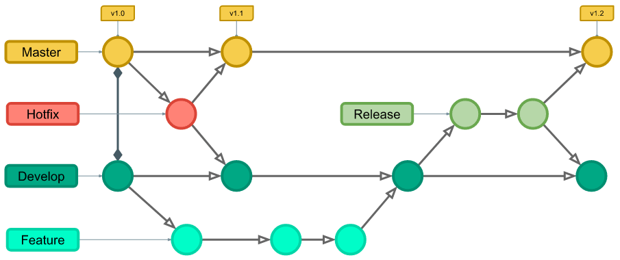

- [Introdução](#introdução)
- [Requisitos](#requisitos)
- [Instalação](#instalação)
- [Estrutura](#estrutura)
- [Desenvolvimento](#desenvolvimento)
- [Contribuição](#contribuição)

## Introdução

O frontend será o ambiente onde o usuário irá interagir com o sistema, tanto o candidato, quanto os avaliadores do sistema, para que consigam participar do processo seletivo em questão de uma forma bem tranquila e otimizada.

## Requisitos

A aplicação frontend utilizará as seguintes tecnologias:

- HTML5
- CSS3
- JavaScript
- Webpack
- Babel
  
Para contextualizar, o Webpack será utilizado para otimizar e empacotar o código-fonte do projeto para facilitar o desenvolvimento e também o deploy da aplicação. Em conjunto com ele, o Babel irá atuar para garantir que o código gerado seja compatível com grande parte dos navegadores web.

## Instalação

Para instalar todas as dependências do projeto, basta rodar o comando `npm install`.

## Estrutura

O projeto está estruturado da seguinte forma:

- dist/ - arquivos de distribuição do projeto
- src/ - código-fonte do projeto
  - assets/ - pasta de assets como fotos, svg, gifs, etc.
  - components/ - contém todos os componentes utilizados na aplicação: botões, navbars, etc.
  - models/ - contém os modelos de dados da aplicação: candidato, avaliador, entrevista, etc.
  - pages/ - contém arquivos de estrutura, estilo e lógica da página

## Desenvolvimento

O desenvolvimento deve ser feito através de módulos, permitindo assim a reutilização de código, além de construções de componentes para permitir a estruturação das páginas de forma personalizadas, dependendo dos dados obtidos do backend da aplicação.

É importante lembrar que todo código escrito, seja função ou classe, possua um propósito único, a fim de facilitar o reuso e a manuntenção do código.

## Contribuição

A contribuição deve ser feita seguindo o fluxo do Git Flow, como mostrado no exemplo abaixo:

O padrão de commits deve ser o de [Commits Semânticos](https://www.notion.so/Commits-Sem-nticos-7b68fea8057f44be94233de5f4893c23), o repositório está configurado para permitir apenas commits que seguem o padrão, além de possuir uma ferramenta automatizada para gerar as mensagens de commits, através do comando `npm run commit`.

No contexto do projeto, as branches principais são as branches main(para produção) e develop(para desenvolvimento) e cada funcionalidade nova será uma branch feature, criada a partir da branch develop.

**Não devem ser feitos commits nas branches principais!** Cada funcionalidade nova ou correção de código devem ser feitas em branches próprias e integradas à branch de desenvolvimento a partir de Pull Requests, que serão revisados por no mínimo 2 pessoas.
