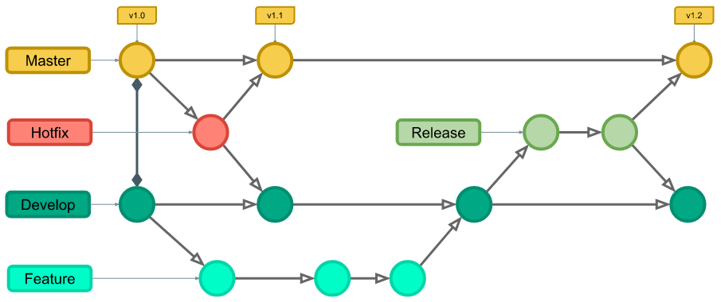

# Plataforma do PS - Frontend

- [Introdução](#introdução)
- [Requisitos](#requisitos)
- [Instalação](#instalação)
- [Estrutura](#estrutura)
- [Desenvolvimento](#desenvolvimento)
- [Contribuição](#contribuição)

## Introdução

O frontend será o ambiente onde o usuário irá interagir com o sistema, tanto o candidato, quanto os avaliadores do sistema, para que consigam participar do processo seletivo em questão de uma forma bem tranquila e otimizada.

## Requisitos

A aplicação frontend utilizará as seguintes tecnologias:

- HTML5
- CSS3
- JavaScript
- Webpack
- Babel

Para contextualizar, o Webpack será utilizado para otimizar e empacotar o código-fonte do projeto para facilitar o desenvolvimento e também o deploy da aplicação. Em conjunto com ele, o Babel irá atuar para garantir que o código gerado seja compatível com grande parte dos navegadores web.

## Instalação

Para instalar todas as dependências do projeto, basta rodar o comando `npm install`.

## Estrutura

O projeto está estruturado da seguinte forma:

- `/dist`: Contém arquivos de distribuição do projeto
- `/src`: Código-fonte do projeto
  - `/assets`: Pasta de assets como fotos, svg, gifs, etc.
  - `/components`: Contém todos os componentes utilizados na aplicação: botões, navbars, etc.
  - `/models`: Contém os modelos de dados da aplicação: candidato, avaliador, entrevista, etc.
  - `/pages`: Contém arquivos de estrutura, estilo e lógica da página
    - `/nome-da-pagina`: Contém arquivos referentes à página especificada
      - `index.html`: Arquivo que se refere à estrutura da página especificada
      - `index.js`: Arquivo principal de lógica da página
      - `index.css`: Arquivo principal de estilo da página

## Desenvolvimento

O desenvolvimento deve ser feito através de módulos, permitindo assim a reutilização de código, além de construções de componentes para permitir a estruturação das páginas de forma personalizadas, dependendo dos dados obtidos do backend da aplicação.

É importante lembrar que todo código escrito, seja função ou classe, possua um propósito único, a fim de facilitar o reuso e a manuntenção do código.

## Contribuição

A contribuição deve ser feita seguindo o fluxo do Git Flow, como mostrado no exemplo abaixo:

O padrão de commits deve ser o de [Commits Semânticos](https://www.notion.so/Commits-Sem-nticos-7b68fea8057f44be94233de5f4893c23), o repositório está configurado para permitir apenas commits que seguem o padrão, além de possuir uma ferramenta automatizada para gerar as mensagens de commits, através do comando `npm run commit`.

No contexto do projeto, as branches principais são as branches main(para produção) e develop(para desenvolvimento) e cada funcionalidade nova será uma branch feature, criada a partir da branch develop.

Cada funcionalidade nova ou correção de código devem ser feitas em branches próprias, seguindo também uma nomenclatura parecida com a dos commits semânticos, adotando o tipo da branch seguindo do nome da branch, por exemplo: `feature/login-de-usuario` ou `hotfix/botao-logout`.

**Não devem ser feitos commits nas branches principais!** Os commits serão feitos nas branches secundárias e integradas às branches principais a partir de Pull Requests, que serão revisados por no mínimo 2 pessoas.

## Manutenção e Regras de Negócio

Guia foi feito para que qualquer desenvolvedor consiga entender rapidamente como o projeto funciona na prática e saiba exatamente o que alterar quando precisar.

### 1. Como o site muda de fase?

O site muda completamente dependendo de qual etapa o Processo Seletivo se encontra (Inscrições abertas, Agendamento, Encerrado). Nós **não usamos** banco de dados para controlar qual tela o candidato vê na página inicial.
Tudo é controlado por variáveis de ambiente no arquivo `.env` do Frontend.

A variável principal é a `PROCESS_STATE`. Ela define o estado base:
- `countdown`: Tela de contagem regressiva (antes do PS começar).
- `form`: Formulário para as pessoas se inscreverem.
- `interview`: Tela onde os candidatos agendam as entrevistas.
- `end`: Tela de fim de processo.

**Transição Automática (Countdown -> Form):**
Para evitar que desenvolvedores precisem mudar a variável manualmente no momento exato em que as inscrições abrem, adicionamos a variável `PROCESS_START_DATE` (ex: `2026-06-01T12:00:00`). 
- O frontend usa essa data para fazer a contagem regressiva.
- Se o `PROCESS_STATE` estiver como `countdown`, mas o momento atual (data do build) já tiver ultrapassado a data estipulada em `PROCESS_START_DATE`, o Webpack **forçará automaticamente** a aplicação a renderizar o estado `form`.
- No lado do cliente, assim que o relógio da contagem zera, a página redireciona o usuário direto para `/inscricao`.

**Como atualizar a fase do processo manualmente (para as demais etapas):**
Se você quiser mudar o site de "Inscrições" (`form`) para "Entrevistas" (`interview`), você precisa fazer o seguinte:
1. Ir na plataforma onde o frontend está hospedado (ex: Vercel).
2. Mudar o valor da variável `PROCESS_STATE`.
3. Clicar para fazer um novo *Deploy* (reconstruir o site).

*Dica: Os nomes dos estados correspondem exatamente às pastas que estão dentro de `src/pages/home/states/`.*
### 2. Como as pessoas fazem Login?
O sistema tem dois tipos de usuários e eles entram de jeitos bem diferentes:
**Candidatos (Sem Senha)**
Candidatos não criam senha. Eles acessam o painel de agendamento através de um link seguro enviado por e-mail.
- **O que acontece:** Quando ele clica no link (ex: `/agendar-entrevista?code=123`), o código `123` fica salvo no navegador dele (`localStorage`).
- **Como atualizar/testar:** Se precisar testar como candidato, simule colocando o código no seu `localStorage` através do console do navegador, usando a chave `ps_lawd_access_code`. O botão "Sair" na tela dele simplesmente apaga esse código.
**Avaliadores da Liga (Com Senha)**
Os avaliadores entram pela página `/login` com e-mail e senha. Eles têm acesso a páginas que os candidatos não têm: `/minha-agenda`, `/agendamento-geral`, e `/entrevista`.
### 3. O Calendário de Agendamento (`/minha-agenda`)
Se você for fazer manutenção no calendário onde os avaliadores colocam os horários deles (`minha-agenda`), preste atenção nestes detalhes:
- **Limite de visualização:** Por regra de negócio, o avaliador só pode marcar horários de hoje até 2 meses para frente. O botão de voltar `<` nos meses passados some automaticamente.
- **Como atualizar o limite:** Se no futuro a Liga quiser que os horários possam ser marcados para 6 meses, vá no arquivo `frontend-ps/src/pages/minha-agenda/index.js`, procure por `periodEnd = new Date(..., currentDate.getMonth() + 2, ...)` e troque o `2` pelo número de meses desejado.
- O calendário se redesenha toda vez que você clica na setinha de passar o mês, apagando os dias antigos e criando novos.
### 4. O Fluxo de Agendamento do Candidato (`/agendar-entrevista`)
Quando o candidato vai marcar a entrevista dele, o código verifica regras importantes:
- **Regra das 24 Horas:** O candidato pode remarcar ou cancelar a entrevista, **mas só se faltar mais de 24 horas para ela acontecer**.
- **Onde isso fica:** O bloqueio principal acontece no *Backend*, mas o Frontend (`agendar-entrevista/index.js`) avisa o candidato com um alerta (*"A alteração só pode ser feita com 24 horas de antecedência"*). Se precisarem mudar esse limite para 48h no futuro, lembre-se de mudar a mensagem no HTML (`agendar-entrevista/index.html`) e alterar a validação lá no Backend.
### 5. Rotas e Links Quebrados (Vercel)
Temos uma rota dinâmica de sala de entrevista (ex: `/entrevista/ID-DO-CANDIDATO`).
Como não usamos React (Next.js/React Router), servidores comuns não sabem ler isso e dão erro "404 Not Found".
- **Como resolvemos:** Existe um arquivo chamado `vercel.json` na raiz do projeto. Ele diz para o servidor: *"Toda vez que alguém tentar acessar `/entrevista/qualquer-coisa`, abra o arquivo `/entrevista/index.html` e deixe o JavaScript se virar"*.
- **Como atualizar:** Se você criar uma página nova no futuro que também tenha link com `/ID`, lembre-se de adicionar a nova regra dentro desse `vercel.json`.
### 6. Cores e Estilos (CSS)
- Não usamos ferramentas externas (como Bootstrap ou Tailwind). Tudo é CSS puro.
- **Como atualizar cores:** Sempre que for pintar um botão ou texto da LAWD, **não use a cor direto no código** (ex: `color: #7046e9`). Use as **Variáveis CSS** do projeto, como `color: var(--purple-400)`. Se um dia a LAWD mudar a identidade visual, basta alterar o arquivo base de variáveis e o site inteiro atualizará sozinho.
